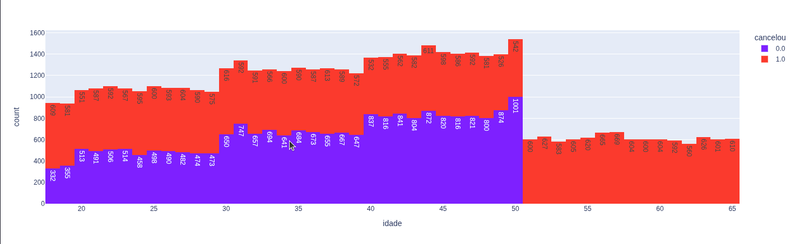
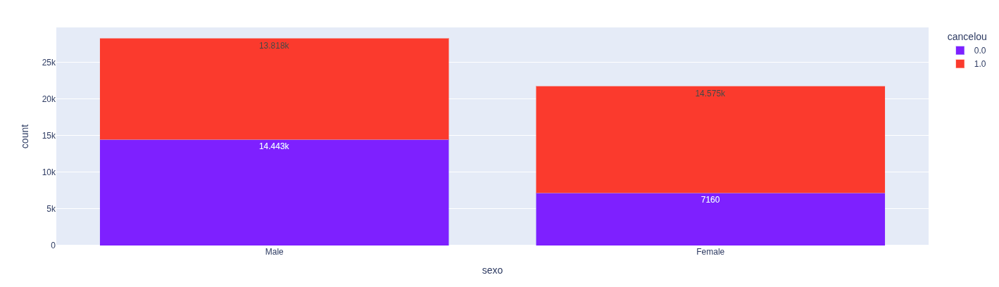
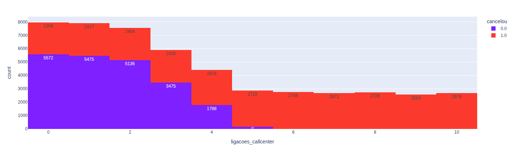

# 📊 Análise de Dados usando Python com Jupyter

Projeto de análise de cancelamento de clientes (churn) utilizando Python e Jupyter Notebook. O foco do projeto é o tratamento de dados, a análise exploratória e a criação de visualizações interativas para identificar padrões e fatores que influenciam o cancelamento de clientes.

---

## 📌 Sobre o Projeto

Este projeto realiza uma análise exploratória em uma base de dados de cancelamentos de clientes. O objetivo é compreender o comportamento dos usuários, identificar padrões de churn e gerar insights que possam auxiliar na tomada de decisões para redução da evasão de clientes.

A análise segue as principais etapas de um projeto real de dados: carregamento da base, limpeza e tratamento dos dados, análise exploratória, criação de gráficos e interpretação dos resultados.

---

## 📁 Base de Dados

A base contém informações de clientes e uma coluna indicando se houve ou não cancelamento.  
Todas as manipulações são feitas apenas no Python — o arquivo original não é alterado.

---

## ⚙️ Tecnologias e Bibliotecas

- Python  
- Jupyter Notebook  
- Pandas  
- Plotly  
- Openpyxl  
- Nbformat  
- Ipykernel  

---

## 📈 Principais Insights

- Aproximadamente **56% dos clientes cancelaram** o serviço.  
- Clientes com **contrato mensal** apresentaram maior taxa de cancelamento.  
- Mais de **4 ligações ao call center** têm forte relação com churn.  
- **Atrasos acima de 20 dias** resultaram em altíssimo índice de cancelamento.  

Com base nesses dados, foram propostas ações como incentivo a contratos mais longos, criação de alertas no call center e maior controle sobre atrasos de pagamento.

---

## 📊 Exemplos de Visualizações

_Imagens de alguns dos graficos gerados:_





---

## ⚙️ Inicialização do ambiente no Linux

Siga os passos abaixo para preparar o ambiente e executar a automação.

### 1️⃣ Criar Ambiente virtual

```bash
python3 -m venv venv
```
### 2️⃣ Ativar o ambiente virtual

Linux/Mac:
```bash
source venv/bin/activate
```
Windows:
```bash
venv\Scripts\activate
```
### 3️⃣ Instalar bibliotecas necessárias

Forma recomendada (usando o arquivo requirements.txt):

```bash
pip install -r requirements.txt
```
Ou, manualmente:
```bash
pip install pandas openpyxl nbformat ipykernel plotly
```
---

## 👨‍💻 Autor

**Matheus Henrique**  
Estudante de Engenharia de Software  
Projeto desenvolvido para fins de estudo em analise de dados com Python